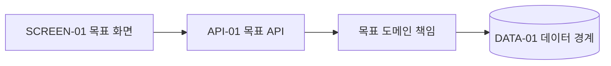

# MCP SDD 개발 설계 형식

`system_design.md`는 개발자가 PRD와 사용자 스토리를 이해하고, 현재 시스템에서 무엇을
어떻게 바꿀지 합의한 뒤, 이 문서 하나와 실제 코드만으로 구현·검증·배포 판단까지 이어갈
수 있는 한국어 설계 초안이다. 본문은 **기획 이해 → AS-IS → TO-BE → 변경 지도 → 상세
계약 → 기능별 구현 패킷** 순서로 읽힌다. 코드 조사·SSOT·영향도 근거는 삭제하지 않고 문서
마지막 부록에 모은다. 상세 Impact Dossier의 SSOT는 `prd.md` 맨 아래 §9다.

## Frontmatter

```yaml
---
schemaVersion: "sdd-design.v2"
id: "SPEC-<slug>-<YYYY-MM>"
type: "sdd-design"
status: "draft"
projectId: "<projectId>"
outputLanguage: "ko"
derivedFrom: ["prd.md", "user_stories.md"]
requestStatus: "approved"
storiesStatus: "approved"
requestRevision: "sha256:<hex>"
storiesRevision: "sha256:<hex>"
productInputFingerprint: "sha256:<hex>"
evidenceFingerprint: "sha256:<hex>"
designRevision: "sha256:<hex>"
approvedRevision: ""
approvedAt: ""
approvedBy: ""
review:
  verdict: "PASS | NEEDS_WORK"
  readiness: "ready | partial | blocked"
---
```

이 header는 문서 식별, 입력·승인·최신성 일치와 compact review만 보관한다. 영향도 상태,
source parity, 소스 커밋, 조사 한계와 상세 자체 검토는 부록 A와 `prd.md` §9에 둔다.

## 본문

````markdown
# 시스템 설계 — <요청 제목>

> **DRAFT — 개발자 검토 필요.** 입력: `prd.md`, `user_stories.md`.
> 구현 준비도: `<ready | partial | blocked>` — <한 문장 이유>.
> 상세 코드·SSOT·영향도 근거: 부록 A 및 `prd.md` §9.

## 1. 이번 회의의 결론 목표

한두 문장으로 변경 목적, 사용자 결과와 시스템 경계를 설명한다.

### 이번에 만드는 것

- <기능 또는 표면>

### 이번에 만들지 않는 것

- <명시적 비목표와 기존 경계>

### 이번 회의에서 결정할 것

| 의제 ID | 이번 회의에서 정할 것 | 왜 지금 필요한가 | 추천안 또는 선택지 | 결정자 |
| --- | --- | --- | --- | --- |
| O-01 | | | | |
| TQ-01 | | | | |

제품 미결 질문은 PRD의 `O-*`를 그대로 참조한다. 설계 중 발견한 기술 질문만 `TQ-*`를
부여하며, 결정되지 않은 의제에 `DEC-*`를 미리 부여하지 않는다.

## 2. 기획 이해와 사용자 흐름

PRD 전체를 복사하지 않고 개발자가 설계 판단에 필요한 문제, 사용자, 수용 결과와 비범위를
요약한다. 역할별로 **진입 → 정보 확인 → 조치 → 결과**를 쓴다.

| 역할 | 현재 문제 | 시작점 | 확인하는 정보 | 가능한 조치 | 기대 결과·수용 기준 |
| --- | --- | --- | --- | --- | --- |
| <사용자> | | | | | R-01 / AC-01 |

## 3. 현재 시스템 구조(AS-IS)

현재 구조는 `confirmed-path` 원문으로 확인한 사실만 쓴다. 부분 근거나 후보는 다이어그램에서
실선으로 연결하지 않고 `확인 필요`로 표시한다. 전체 시스템이 아니라 이번 변경과 맞닿은
화면 → API → 도메인 → 데이터/외부 경계를 설명한다.

### 3-1. 현재 구성과 책임

복잡한 경계는 작은 Mermaid 구성도 하나로 보여 준다. 노드에는 아래 변경 지도에서 재사용할
`SCREEN/API/EVENT/DATA` ID를 붙인다. 단순 변경이면 표만 쓴다.


| 표면 ID | 현재 책임 | 현재 호출자·소비자 | 현재 데이터·외부 경계 | 확인 상태 | 현재 제약·문제 |
| --- | --- | --- | --- | --- | --- |
| API-01 | | | DATA-01 | <확인됨 / 부분 / 후보> | |

### 3-2. 현재 핵심 호출 흐름

변경 판단에 분기·오류·비동기 경계가 중요할 때만 sequence diagram 또는 decision flow를 쓴다.
본문은 동작을 이해시키고, 파일·심볼·source commit은 부록 A-3~A-7에서 증명한다.

### 3-3. 현재 제약과 개선 지점

| 문제 ID | 현재 제약·문제 | 사용자·운영 영향 | 원인 경계 | 목표 구조에서 해소할 CHG |
| --- | --- | --- | --- | --- |
| GAP-01 | | | API-01 / DATA-01 | CHG-01 |

## 4. 목표 시스템 구조(TO-BE)

### 4-1. 목표 구성과 책임

AS-IS와 같은 시스템 경계를 사용해 무엇이 추가·수정·유지되는지 보여 준다. 확인되지 않은
연결은 점선과 `후보` 표기를 사용한다. 같은 정보를 반복하는 거대한 다이어그램은 만들지 않는다.



| 구성요소·외부 시스템 | 목표 책임 | 소유 데이터 | 연결 방식 | 기존 경계와의 관계 |
| --- | --- | --- | --- | --- |
| | | | | |

### 4-2. 목표 핵심 호출 흐름

정상 흐름과 중요한 권한·부분 실패·비동기 흐름을 설명한다. 구현 상세는 §6, 기능 단위 연결은
§8에서 ID로 참조한다.

## 5. 기준 변경 지도(AS-IS → TO-BE)

이 표가 구성요소 변경 분류의 유일한 SSOT다. 허용 유형은 `NEW`, `MODIFY`, `REUSE`,
`NO-CHANGE`, `DEPRECATE`, `DELETE`, `UNKNOWN`이다. 다른 절은 유형을 다시 결정하지 않고
이 행을 참조한다.

| 표면 ID | 종류 | 변경 유형 | AS-IS | TO-BE | 영향받는 소비자·데이터 | CHG | 상세 절 |
| --- | --- | --- | --- | --- | --- | --- | --- |
| SCREEN-01 | 화면 | NEW | 없음 | <목표> | API-01 | CHG-01 | §6-1 |
| API-01 | 동기 계약 | MODIFY | <현재 계약> | <목표 계약> | SCREEN-01 / DATA-01 | CHG-01 | §6-2 |

변경 유형별 상세 수준은 다음과 같다.

- `NEW`: 목표 계약·흐름·실패 처리·구현·검증 경계를 상세히 쓴다.
- `MODIFY`: 현재/목표 차이, 기존 소비자, 호환성과 회귀 위험을 상세히 쓴다.
- `DEPRECATE`·`DELETE`: 소비자 감사, 대체 계약, 관측, 제거 순서와 rollback을 상세히 쓴다.
- `UNKNOWN`: 확인할 원문과 차단되는 결정·슬라이스를 쓴다.
- `REUSE`·`NO-CHANGE`: 재사용 이유 또는 변경 금지 경계만 짧게 쓴다.

## 6. 구성요소별 상세 계약

해당하지 않는 하위 절은 `해당 없음`과 이유를 쓴다. `NEW`, `MODIFY`, `DEPRECATE`,
`DELETE`는 구현 가능한 수준으로 작성한다. `REUSE`, `NO-CHANGE`는 변경 지도와 핵심 경계만
참조한다. `UNKNOWN`을 추측으로 채우지 않는다. 아래 표의 `변경 유형` 열은 §5 값을 그대로
복사한 탐색용 보기이며 별도 판단 지점이 아니다. §5와 다르면 문서 오류다.

Inventory contract: `ID | human-readable name | method / path or screen route | status`를
항상 독자가 한 행에서 확인할 수 있게 한다.

### 6-1. 화면

| 화면 ID | 사람이 이해할 이름(human-readable name) | screen route·진입점 | 변경 유형 | 사용자·목적 | 표시 정보 | 행동·이동 | 연결 계약·이벤트 | 상태 |
| --- | --- | --- | --- | --- | --- | --- | --- | --- |
| SCREEN-01 | <화면 이름> | `/exact/route` | NEW | | | | API-01 / EVENT-01 | <Proposed · Approved / Existing · Confirmed / Candidate> |

모든 화면은 ID만 쓰지 않고 이름과 exact screen route를 함께 보여 준다. 신규 TO-BE route는
`Proposed · Approved`, 현재 코드에서 bounded read로 확인한 route는
`Existing · Confirmed`, 미확정 값은 `Candidate`로 구분한다.

변경 화면마다 로딩, 정상, 빈 결과, 권한 없음, 오류와 부분 실패 중 적용되는 상태를 쓴다.

| 화면 ID·상태 | 진입 조건 | 표시 정보 | 가능한 행동 | API·이벤트 결과 | 복구·fallback |
| --- | --- | --- | --- | --- | --- |
| SCREEN-01 / 로딩 | | | | | |

### 6-2. 동기 API

| API ID | 사람이 이해할 이름(human-readable name) | 변경 유형 | method / path | 호출자 | 목적 | 권한 | 상태 |
| --- | --- | --- | --- | --- | --- | --- | --- |
| API-01 | <계약 이름> | MODIFY | `GET /exact/path` | SCREEN-01 | | | <Proposed · Approved / Existing · Confirmed / Candidate> |

모든 API는 ID만 쓰지 않고 계약 이름과 exact method/path를 함께 보여 준다. 신규 TO-BE path는
`Proposed · Approved`, 현재 코드 원문에서 확인한 계약은 `Existing · Confirmed`, 아직 결정되지
않은 값은 `Candidate`다. `tasks.md` must not invent an API path; `Candidate`가 하나라도 구현에
필요하면 §11 Evidence-Resolution에서 먼저 해결한다.

#### API-01. <계약 이름>

| 항목 | AS-IS | TO-BE | 호환성·결정 상태 |
| --- | --- | --- | --- |
| 요청 | | | |
| 응답 | | | |
| 권한 | | | |
| 오류·부분 실패 | | | |
| 호출자·소비자 | | | |

요청·응답 구조는 확인되거나 결정된 필드만 쓴다. 변경 필드가 있으면 아래 표 또는 실제
프로젝트 언어의 타입 예시를 사용한다.

| 필드 | 타입 | 필수·nullable | 의미·생성 기준 | AS-IS → TO-BE | 결정 상태 |
| --- | --- | --- | --- | --- | --- |
| `field` | | | | | <확정 / 미결> |

| 조건·분기 | 결과·오류 | retry·timeout·fallback | 관측 | VER |
| --- | --- | --- | --- | --- |
| | | | | VER-01 |

### 6-3. 이벤트·잡

새 이벤트를 만들지 않고 기존 이벤트를 지표로 관측하면 `관측 전용`으로 표시한다.

| EVENT ID | 변경 유형 | producer·발생 조건 | payload·schema | consumer | 중복·순서·재시도 | PII·관측 | 상태 |
| --- | --- | --- | --- | --- | --- | --- | --- |
| EVENT-01 | NEW | | | | | | |

### 6-4. 데이터·DB

| DATA ID | 변경 유형 | 소유 저장소·대상 | 상태·판정·schema 변경 | read/write 주체 | API·EVENT | 결정 상태 |
| --- | --- | --- | --- | --- | --- | --- |
| DATA-01 | MODIFY | | | | API-01 | |

DB 변경이 있으면 table·column·type·nullable·default·key·index와 아래 배포 계약을 쓴다.
DB 변경이 없으면 `기존 데이터 read만 사용하며 schema·write 변경 없음`을 명시한다.

| 순서 | 마이그레이션·backfill·호환성 작업 | 구버전 영향 | 검증 | rollback |
| --- | --- | --- | --- | --- |
| 1 | | | | |

### 6-5. 외부 연동

| 연동 ID | 변경 유형 | 요청·응답 계약 | 인증·권한 | timeout·retry·fallback | 호환성·금지 경계 | 상태 |
| --- | --- | --- | --- | --- | --- | --- |
| EXT-01 | | | | | | |

### 6-6. 폐기·삭제

| 표면 ID | 대체 계약 | 확인한 소비자 | deprecation·관측 기간 | 제거 순서 | rollback | 남은 확인 |
| --- | --- | --- | --- | --- | --- | --- |
| API-02 | | | | | | |

소비자를 모두 확인하지 못한 대상은 `DELETE`로 확정하지 않고 `DEPRECATE` 또는 `UNKNOWN`으로
남긴다.

## 7. 상태·권한·오류·비기능 규칙

### 7-1. 비즈니스·상태 결정표

| 규칙 ID | 입력 상태·조건 | 판정·계산 | 결과·상태 변화 | 예외·금지 경계 | 적용 ID·CHG·VER |
| --- | --- | --- | --- | --- | --- |
| RULE-01 | | | | | API-01 / CHG-01 / VER-01 |

PRD 규칙·수용 기준·스토리는 구현 규칙으로 추적한다.

`WHEN`, `모든`, `100%`, 비율과 `H-*` 분모가 있는 규칙은 원문의 eligibility gate,
skip/suppression 조건과 승인된 제외를 모두 결정표에 넣는다. 구현이 보존하는 원천 실행 집합과
제품이 약속한 집합이 다르면 기술 제약으로 숨기지 않고 제품 개정으로 돌린다. 사용자에게 보이는
원인·사유·label은 `errorMessage`, `reason`, `description` 같은 이름만으로 사용자 언어라고
판정하지 않고 정확한 mapping·상수·sanitization·formula를 함께 쓴다.

| PRD 규칙·AC·스토리 | 적용 규칙·표면 | 정상 결과 | 예외·경계 | CHG·VER |
| --- | --- | --- | --- | --- |
| R-01 / AC-01 / US-01-S01 | RULE-01 / API-01 | | | CHG-01 / VER-01 |

### 7-2. 횡단 관심사

| 영역 | 적용 여부·설계 | 실패·위험 | 검증·관측 |
| --- | --- | --- | --- |
| 권한·tenant 격리 | | | |
| 개인정보·보존 | | | |
| 성능·용량·pagination | | | |
| 정합성·동시성·멱등성 | | | |
| timeout·retry·부분 실패 | | | |
| 로그·metric·trace·alert | | | |

비적용 영역은 `N/A`와 이유를 쓴다.

## 8. 기능별 구현 패킷

`tasks.md`가 그대로 이어받을 수 있도록 사용자 결과 단위 `SLICE-*`를 정의한다. 기술
레이어가 아니라 화면 → API → 로직 → DB·이벤트 → 검증이 한 결과를 완성하도록 묶는다.

| 슬라이스 | 완성할 사용자 결과 | 영향 표면 ID | 선행 조건 | Primary CHG | 관련 CHG | VER | 병렬화·출시 경계 |
| --- | --- | --- | --- | --- | --- | --- | --- |
| SLICE-01 | | SCREEN-01 / API-01 / DATA-01 | | CHG-01 | | VER-01 | |

### SLICE-01. <사용자 결과>

| 항목 | 구현 인계 내용 |
| --- | --- |
| 제품 연결 | R-01 / AC-01 / US-01-S01 |
| AS-IS → TO-BE | GAP-01 → CHG-01 |
| 화면·계약·데이터 | SCREEN-01 / API-01 / DATA-01 |
| 코드 경계 | EDIT-01 / NOEDIT-01 / CAND-01 |
| 구현 순서 | 계약 → 도메인 로직 → 데이터 → 화면·소비자 → 관측 |
| 예외·금지 범위 | |
| 완료 조건 | VER-01 통과와 rollback 가능 |
| 병렬 작업·인계 | |

각 `CHG-*`는 Primary 슬라이스 하나에만 속하고 모든 `VER-*`는 하나 이상의 슬라이스가 소유한다.
공통 계약, 마이그레이션, 권한처럼 여러 사용자 결과가 공유하는 선행 작업만 `SLICE-00`으로 둔다.
선행 조건이 있는 슬라이스를 `독립`으로 표시하지 않는다. `관련 CHG`는 소유권을 대신하지 않는다.

## 9. 구현·마이그레이션·배포·운영 계획

| CHG ID | 완성할 결과·변경 이유 | 담당 repo·경계 | 호환성·데이터 안전 | 배포·rollback | 관찰 지표 |
| --- | --- | --- | --- | --- | --- |
| CHG-01 | | | | | |

| 배포 순서 | 배포·마이그레이션·flag 행동 | 진입 조건 | 성공 판단 | 실패 시 중단·rollback |
| --- | --- | --- | --- | --- |
| 1 | | | | |

## 10. 검증 계약과 개발 완료 조건

| VER ID | 검증 대상 CHG·규칙·시나리오 | 수준·방법 | 입력·조건 | 기대 결과 | 확인된 테스트 위치·명령 |
| --- | --- | --- | --- | --- | --- |
| VER-01 | CHG-01 / RULE-01 | | | | |

### 개발 완료 조건

- 모든 제품 요구가 표면·변경·슬라이스·검증 ID에 연결됨
- 모든 `NEW`·`MODIFY` 계약과 코드 경계가 구현 가능한 수준으로 확인됨
- 모든 `DEPRECATE`·`DELETE` 소비자와 제거·rollback 순서가 확인됨
- DB 변경의 마이그레이션·backfill·호환성·rollback이 확인됨
- 권한·오류·부분 실패·비기능 요구가 결정되거나 `N/A+이유`로 처분됨
- 테스트 위치·convention·명령이 확인됨
- 배포·관측·rollback 조건과 소유자가 확인됨
- 구현을 막는 `O-*`, `TQ-*`, implicated `UNKNOWN`, candidate-only target이 없음

위 조건을 만족하지 않으면 `ready`가 아니다. 정확한 구현 위치나 명령을 추측해서 조건을
채우지 않는다.

## 11. 설계 결정·미결 질문과 다음 행동

### 제품 결정·미결 질문 전달

| 제품 ID | 현재 상태·내용 | 설계에 미치는 영향 | 이번 회의 처리 |
| --- | --- | --- | --- |
| D-01 | <확정 제품 결정> | | 설계 전제 |
| O-01 | <open / blocked / closed> · <질문> | | <그대로 추적 / 제품 문서 개정 필요> |

`D-*`와 `O-*`는 PRD 소유다. 답이 제품 범위·규칙·AC·성공 판정을 바꾸면 PRD와 스토리
개정, 영향도 갱신, 제품 재승인으로 돌아간다.

### 기술 설계 결정과 위험 수용

| DEC ID | 기술 결정·수용 위험 | 제품·요구 근거 ID | 이유 | 영향 표면·CHG | 소유자 | 범위·재검토 조건 |
| --- | --- | --- | --- | --- | --- | --- |
| DEC-01 | | D-01 / R-01 / AC-01 | | API-01 / CHG-01 | | |

### 기술 미결 질문과 다음 확인

| TQ ID | 기술 질문·위험 | 영향 ID | 회의에서 정할 것 | 소유자 | 결정 전 확인 |
| --- | --- | --- | --- | --- | --- |
| TQ-01 | | | | | 부록 A-3~A-7 |

### Evidence-Resolution — tasks 생성 전 해결

| ER ID | 확인할 한 가지 사실 | 막힌 표면·CHG·SLICE | 현재 후보·누락 필드 | 다음 bounded source read | 완료 판정 | 결과 반영 |
| --- | --- | --- | --- | --- | --- | --- |
| ER-01 | <파일·심볼·테스트 명령·계약 등> | API-01 / CHG-01 / SLICE-01 | CAND-01 / <누락> | <repo·file 범위와 확인 질문> | EDIT-* 또는 NOEDIT-* 및 exact test command 확정 | PRD §9 갱신 → 새 design revision |

이 표는 조사 backlog의 유일한 reader-facing 위치다. `partial`, candidate-only target, open
`O-*`/`TQ-*`, exact test command 누락이 있으면 여기에 기록하고 `tasks.md`를 만들지 않는다.
해결 후 §5~§10과 부록 A를 갱신하고 Self Review를 다시 수행한다.

---

## 부록 A. 근거·영향도·조사 한계

본문 결정을 검증하거나 구현 위치를 찾을 때 읽는 영역이다. `prd.md` §9가 Impact Dossier의
SSOT이며, 여기에는 구현 인계에 필요한 최소 경로 지도와 참조만 둔다.

### A-1. 입력·근거 요약

| 항목 | 상태 | 본문에 미치는 영향 |
| --- | --- | --- |
| PRD/스토리 | | |
| SOT 최신성·source parity | | |
| 영향도 조사 범위 | | |

### A-2. 영향 8영역 판정

| 영향 영역 | 판정 | 이유 | evidence id | CHG 또는 N/A | 남은 확인 |
| --- | --- | --- | --- | --- | --- |
| API·계약 | <yes / no / unknown> | | | | |
| DB·데이터 | <yes / no / unknown> | | | | |
| 비즈니스 로직·상태 | <yes / no / unknown> | | | | |
| UI·UX | <yes / no / unknown> | | | | |
| Job·이벤트 | <yes / no / unknown> | | | | |
| 외부 연동 | <yes / no / unknown> | | | | |
| 보안·권한 | <yes / no / unknown> | | | | |
| 관측성·배포 | <yes / no / unknown> | | | | |

`no`는 확인한 범위와 negative evidence가 있을 때만 쓴다. implicated `unknown`은 별도
`DEC-*` 위험 수용이 없으면 설계를 차단한다.

### A-3. AS-IS 경로 근거

`graph_trace`는 `화면 ↔ API ↔ 도메인 ↔ 데이터/외부` 후보를 빨리 찾는 보조 수단이다.
빈 결과나 후보는 영향 없음의 증거가 아니다. 정확한 원문 근거는 `prd.md` §9를 참조한다.

| 시작 표면 ID | 경로 표면 ID | 확인한 경로 | 확인됨 | 후보·미확인 | 다음 확인 | evidence id |
| --- | --- | --- | --- | --- | --- | --- |
| SCREEN-01 | API-01 / DATA-01 | | | | | |

### A-4. 화면 구현 근거

| 화면 ID | 저장소 | route·진입점 | component·파일/심볼 | 권한 | 표시 상태·행동 | 연결 계약 | 상태·evidence id |
| --- | --- | --- | --- | --- | --- | --- | --- |
| SCREEN-01 | | | | | | API-01 | <confirmed / candidate / partial> |

### A-5. API·이벤트 구현 근거

| 계약 ID | method·path / event | 저장소 | handler | service·use case | DB·외부 | request·response·error | 권한·소비자 | 상태·evidence id |
| --- | --- | --- | --- | --- | --- | --- | --- | --- |
| API-01 | | | | | | | | <confirmed-path / partial-path / candidate> |

### A-6. 코드 편집 대상

| target id | 저장소·full source commit | 확인한 파일·심볼 | 위치 힌트 | 변경 의도 | 상태 | 누락 필드·다음 원문 확인 | evidence id |
| --- | --- | --- | --- | --- | --- | --- | --- |
| CAND-01 | | | | | candidate-target | | |

`edit-target`은 full commit·파일·심볼·advisory line range·변경 의도·bounded-read evidence가
모두 있어야 한다. 라인 번호 단독 참조와 search-hint는 수정 권한이 아니다.

### A-7. 영향 시스템과 코드 읽기 범위

| 경계 | 파일·심볼 또는 문서 | 확인한 책임 | 함께 읽은 소비자·테스트·설정 | 읽기 상태 | 본문 연결 |
| --- | --- | --- | --- | --- | --- |
| | | | | <confirmed-path / partial-path / candidate> | |

### A-8. 요구사항·변경·검증 연결

| 입력 ID | 설계 반영 또는 제외 이유 | 영향 표면 ID | CHG | SLICE | VER 또는 근거 공백 | evidence id |
| --- | --- | --- | --- | --- | --- | --- |
| R-01 / AC-01 / US-01-S01 | | SCREEN-01 / API-01 / DATA-01 | CHG-01 | SLICE-01 | VER-01 | |

### A-9. 상세 근거와 조사 한계

- 상세 Impact Evidence Matrix, `document_resolve` 결과와 검색·원문 읽기 기록은 `prd.md` §9를 따른다.
- `confirmed-path`만 현재 구현 사실 또는 정확한 변경 위치의 근거다.
- `partial-path`, 후보, 빈 graph 결과와 미열람 범위는 본문 §11의 미결정 사항 또는 후속 확인으로 연결한다.
- 자체 검토의 blockers, warnings, coverage와 readiness 이유를 요약한다.

### A-10. 구현 준비도 원장

이 원장은 `ready` 판정의 기계 검증 입력이다. 문구만 `확인됨`으로 쓰지 말고 실제 원문과
실행 결과를 행으로 남긴다. 하나라도 비어 있거나 불완전하면 §11 Evidence-Resolution로
돌리고 `tasks.md`를 생성하지 않는다.

#### A-10-1. Source checkout 일치

| repo | evidence commit | implementation baseline | read proof | status |
| --- | --- | --- | --- | --- |
| <implementation repo> | <40-char oid> | <40-char oid> | <workspace HEAD or exact Git object read> | MATCHED |

원문을 읽은 Git tree와 구현 baseline이 다르면 `MATCHED`를 쓰지 않는다. 실제 구현 checkout의
`git rev-parse HEAD` 일치는 `tasks.md` 실행 직전 Preflight에서 다시 확인한다.

#### A-10-2. API 필드 근거 원장

| API | direction | field | type/null | value origin | source/formula | consumer | status |
| --- | --- | --- | --- | --- | --- | --- | --- |
| API-01 | request | `query.from` | `date / optional` | constant | `<default·validation symbol>` | SCREEN-01 | CONFIRMED |
| API-01 | response | `data.totalCount` | `number / non-null` | derived | `<source symbol + exact formula>` | SCREEN-01 | CONFIRMED |
| API-01 | error | `INVALID_RANGE` | `string / non-null` | constant | `<exception mapping symbol>` | SCREEN-01 | CONFIRMED |

모든 변경 API는 request, response, error를 각각 가진다. body/query가 없거나 오류가 공통
envelope뿐이어도 `N/A + 근거` 행을 쓴다. `value origin`은 `stored`, `derived`, `constant` 중
하나다. 현재 source로 계산·귀속할 수 없는 값은 `unavailable`로 기록하고 계약에서 제거하거나
제품·데이터 설계를 수정하기 전까지 readiness를 차단한다.
사용자에게 보이는 reason/message/label/copy는 null·non-null·success·failure 등 모든 제어 흐름
분기를 별도 행 또는 완전한 formula로 열거한다. 각 분기는 exact safe mapping, 승인 상수,
sanitization 중 하나에서만 도출되어야 한다. 안전한 fallback이 있어도 다른 분기가 raw/provider/
exception/original message를 직접 반환하면 `CONFIRMED`가 아니며 readiness를 차단한다.

#### A-10-3. 소스 상태 전체 분류

| symbol | discovered | mapped | excluded | target dispositions | disposition map | invariant | evidence | status |
| --- | --- | --- | --- | --- | --- | --- | --- | --- |
| `<ExactEnum>` | `A,B,C` | `A,B` | `C` | `OPEN,CLOSED` | `A→OPEN, B→CLOSED` | `discovered = mapped + excluded` | `<file#symbol>` | COMPLETE |

원문에서 발견한 모든 enum/status 값을 한 번만 `mapped` 또는 `excluded`에 넣는다. 제외에는
제품 의미와 count 합계 포함 여부를 적는다. `target dispositions`는 API 응답 또는 UI 계약에
실제로 선언된 목표 버킷 전체이고, `disposition map`은 모든 mapped 원천 값을 그중 정확히 한
버킷에 연결한다. 원천 값의 분할만 있고 목표 버킷 매핑이 없거나, 선언되지 않은 목표를 가리키면
구현할 수 없으므로 `COMPLETE`가 아니다. 일부 예시나 catch-all도 `COMPLETE`가 아니다.

#### A-10-4. 프론트엔드 구현 연결

| screen | route | server entry | client component | API hook/client | type | test | evidence | status |
| --- | --- | --- | --- | --- | --- | --- | --- | --- |
| SCREEN-01 | `/exact-route` | `app/.../page.tsx` | `...Client.tsx` | `use...` | `...Response` | `...test.tsx` | `<parent/convention source>` | CONFIRMED |

변경 화면마다 server/client 경계, 호출 코드, 타입, 테스트 대상을 모두 적는다. 신규 파일은
확인된 parent와 인접 convention을 evidence에 쓰되 실제 존재하는 것처럼 표시하지 않는다.

#### A-10-5. 검증 명령 Preflight

| id | cwd | command | observed at | exit | result | evidence |
| --- | --- | --- | --- | --- | --- | --- |
| CMD-01 | `<repo root>` | `<copy-paste exact command>` | `<ISO-8601>` | 0 | PASS | `<runner output summary>` |

쓰기 가능한 호환 checkout에서는 명령을 실행하고 `PASS` 또는 기능 부재 `EXPECTED_RED`를
기록한다. 선택된 MCP source tool이 계약상 읽기 전용이라 실행할 수 없을 때만 아래 형식의
`SOURCE_CONFIRMED`를 쓸 수 있다.

```text
exit: N/A
result: SOURCE_CONFIRMED
evidence: wrapper=<build file#script>; module=<module>; runner=<config/plugin>;
  selector=<exact test selector>; adjacentTest=<existing test path#symbol>;
  sourceCommit=<40-char commit>; executionDeferred=task-preflight
```

모든 값은 matched source tree에서 직접 읽은 exact evidence여야 한다. package script 이름이나
관례만으로 만든 plausible command는 허용하지 않는다. `SOURCE_CONFIRMED` 명령은 생성되는
`tasks.md` §1에 그대로 복사하고, 구현 파일을 편집하기 전에 실제 실행하여 `PASS` 또는 기능
부재 `EXPECTED_RED` receipt를 남겨야 한다. 신규 테스트 부재로 의도대로 실패한 명령은 exit와
이유를 남기고 `EXPECTED_RED`로 쓸 수 있다. 이때 runner가 실제로 기동했고 기능 부재·검증
assertion·승인된 신규 테스트 target 부재가 실패 원인이어야 한다. runtime·package manager·dependency·
permission·network·workspace·module resolution 실패는 `EXPECTED_RED`가 아니며 preflight blocker다.

#### A-10-6. Pagination 결정 원장

pagination이 있는 API마다 한 행을 쓴다. pagination이 없으면 이 절은 `N/A`와 이유로 남긴다.

| API | strategy | total order | tie-breaker | hasNext rule | evidence | status |
| --- | --- | --- | --- | --- | --- | --- |
| API-01 | zero-based offset | `createdAt DESC, id DESC` | unique `id` | fetch `size + 1`; extra row exists → true | `<query/source>` | CONFIRMED |

offset·cursor 어느 쪽이든 모든 row에 결정적인 total order와 unique tie-breaker가 있어야 한다.
정렬이나 `hasNext` 계산을 구현자가 추측해야 하면 readiness를 차단한다.
````

## 작성 규칙

- 본문 §1~§11은 개발자의 사고 순서를 따른다. 현재 시스템을 설명하기 전에 목표 컴포넌트를
  나열하지 않는다.
- §5만 변경 유형의 SSOT다. §6~§10은 `SCREEN/API/EVENT/DATA/CHG/SLICE/VER` ID로 참조하고
  변경 유형을 다르게 재정의하지 않는다. 상세 표에 유형을 다시 표시하면 §5 값을 그대로
  복사한 파생 보기로 취급하고 구조 감사에서 일치 여부를 확인한다.
- 본문에는 제품·기술 계약과 구현 결정만 둔다. MCP id, 도구 호출, source commit, 파일·심볼,
  후보 검색 결과와 confidence narration은 부록 A에 둔다.
- AS-IS는 current fact이므로 `confirmed-path`가 필요하다. TO-BE는 제품 의도와 impact에 연결된
  설계 결정이어야 한다. 후보를 AS-IS 실선이나 확정 TO-BE로 표현하지 않는다.
- Mermaid는 AS-IS/TO-BE 시스템 경계 또는 중요한 정상·실패·비동기 흐름을 표보다 빨리
  이해시키는 경우에만 사용한다. 같은 노드 관계를 여러 그림에서 반복하지 않는다.
- `NEW`·`MODIFY`는 request/response/error, 권한, 소비자, 로직, 데이터, 실패와 검증까지 쓴다.
  `REUSE`·`NO-CHANGE`는 짧게 쓴다. `DEPRECATE`·`DELETE`는 소비자와 제거·rollback을 쓴다.
- 화면 변경은 로딩·정상·빈 결과·권한 없음·오류·부분 실패 중 적용 상태를 쓴다.
- DB 변경은 schema, index, migration, backfill, 호환성, 배포 순서와 rollback을 쓴다. DB 변경이
  없으면 schema·write 미변경을 명시한다.
- 각 `CHG-*`는 Primary `SLICE-*` 하나에만 속하고 모든 `VER-*`는 하나 이상의 슬라이스가
  소유한다. 선행 조건이 있는 슬라이스를 `독립`으로 표시하지 않는다. 슬라이스는 기술 레이어가
  아니라 독립적으로 완료·검증 가능한 사용자 결과다.
- `tasks.md`는 `PASS / ready`로 승인된 §8~§10을 실행 카드로 펼칠 뿐 새로운 계약·결정·코드
  위치를 만들지 않는다. `partial` 설계나 §11 Evidence-Resolution이 남은 설계는 tasks를 생성하지 않는다.
- 근거를 숨기거나 버리지 않는다. `document_resolve`, `graph_trace`, source read는 `prd.md` §9와
  부록 A에서 추적 가능해야 한다.
- `확인됨`, `후보`, `가정`, `위험`, `추가 확인 필요`를 구분한다. candidate-only 또는 빈 graph
  결과는 영향 없음의 근거가 아니다.
- 구현을 막는 제품 질문, 기술 질문, implicated unknown, candidate-only target이 남으면
  `ready`로 판정하지 않고 `tasks.md`를 만들거나 덮어쓰지 않는다.
- `ready` 전에는 `scripts/readiness-validator.mjs --design <system_design.md> --tasks <tasks.md>
  --json`의 구조 계약을 충족할 수 있어야 한다. 승인 전에는 임시 v3 task projection으로
  검증하고 폐기하며, 승인 후 실제 `tasks.md`를 다시 검증한다. 95점 미만 또는 critical finding
  하나라도 있으면 `PASS / ready`가 아니다. validator는 EXPECTED_RED 원인, design/product/evidence
  revision binding, canonical product/design hash 재계산, task placeholder, 완전한 구현 패킷,
  모든 `CHG-*`·`VER-*` coverage도 검사한다.

기계 검증은 `using-platty-mcp/references/sdd-revision-contract.md`의 공유 계약을 따른다.
