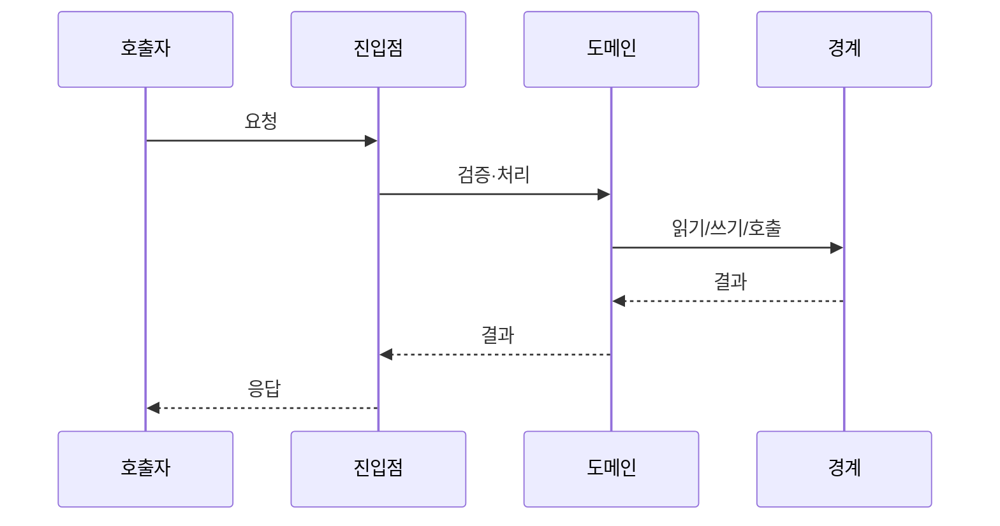
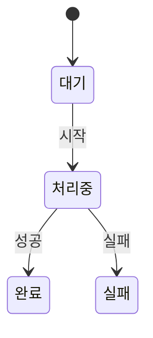

# 개발 설계 — <스펙 제목>

> **DRAFT — 개발자 검토 필요.** 확인한 코드와 근거 경계: <한 줄 요약>.

## 0. 설계 한눈에 보기

| 항목 | 내용 |
| --- | --- |
| 변경 목적 | |
| 영향 저장소/영역 | |
| 주요 변경 경계 | <API·도메인·데이터·화면·이벤트> |
| 가장 큰 위험 | |
| 구현 시작점 | |

## 1. 입력·근거·제약

- **입력 문서**: `request.md`, `stories.md`, `impact.md`
- **근거 경계와 최신성**:
- **확인됨 / 가정 / 위험**:

## 2. 현재 구조 (As-Is)

| 경계 | 파일/심볼 | 현재 역할 | 확인 근거 |
| --- | --- | --- | --- |

세 개 이상 컴포넌트 또는 저장소가 상호작용할 때만 아래 다이어그램을 작성합니다. 그렇지 않으면 이 블록 전체를 삭제합니다.

## 3. 변경 설계 (To-Be)

### 3-1. 변경 경계별 설계

| 경계 | 변경 내용 | 책임 | 기존 패턴/근거 |
| --- | --- | --- | --- |
| API/진입점 | | | |
| 도메인/서비스 | | | |
| 데이터/외부 연동 | | | |
| 화면/호출자 | | | |

### 3-2. 컴포넌트·호출 흐름

여러 경계, 비동기 처리, 트랜잭션, 재시도, 보상 처리가 있을 때만 아래 시퀀스 또는 흐름 다이어그램을 작성합니다. 그렇지 않으면 이 블록 전체를 삭제합니다.

## 4. 계약과 데이터 변경

### 4-1. API·이벤트·화면 계약

| 계약 | 변경 | 호환성 | 확인 근거 |
| --- | --- | --- | --- |

### 4-2. 데이터·마이그레이션

| 대상 | 변경 | 이전 데이터/호환성 | 확인 근거 |
| --- | --- | --- | --- |

## 5. 핵심 처리 흐름과 실패 경로

| 조건 또는 분기 | 처리 | 사용자/운영자 결과 | 복구 또는 재시도 | 근거 |
| --- | --- | --- | --- | --- |

상태가 실제 제품 규칙을 갖는 경우에만 아래 상태 전이 다이어그램을 작성합니다. 그렇지 않으면 이 블록 전체를 삭제합니다.

## 6. 상태·동시성·엣지케이스

| 상황 | 기대 동작 | 구현상 주의점 | 검증 방법 |
| --- | --- | --- | --- |

## 7. 코드 컨벤션과 구현 원칙

| 항목 | 확인한 기존 패턴 | 이번 적용 또는 예외 | 근거 |
| --- | --- | --- | --- |
| 모듈·파일 배치 | | | |
| 이름·타입·DTO | | | |
| 검증·오류 처리 | | | |
| 트랜잭션·외부 호출 | | | |
| 테스트 위치·스타일 | | | |
| 포맷·린트·마이그레이션 | | | |

## 8. 검증·배포·롤백

| 단계 | 확인할 내용 | 자동화 여부 | 실패 시 조치 |
| --- | --- | --- | --- |

## 9. 영역별 변경 요약

| 영역/EPIC | 예상 파일 | 계약/데이터 영향 | 핵심 변경 | 관련 규칙·시나리오 |
| --- | --- | --- | --- | --- |

## 10. 근거 참조

- **상세 근거**: [impact.md](impact.md)
- **확인한 코드 경로**: <파일·심볼·줄 범위>
- **남은 확인 작업과 한계**: <한 줄 요약>
